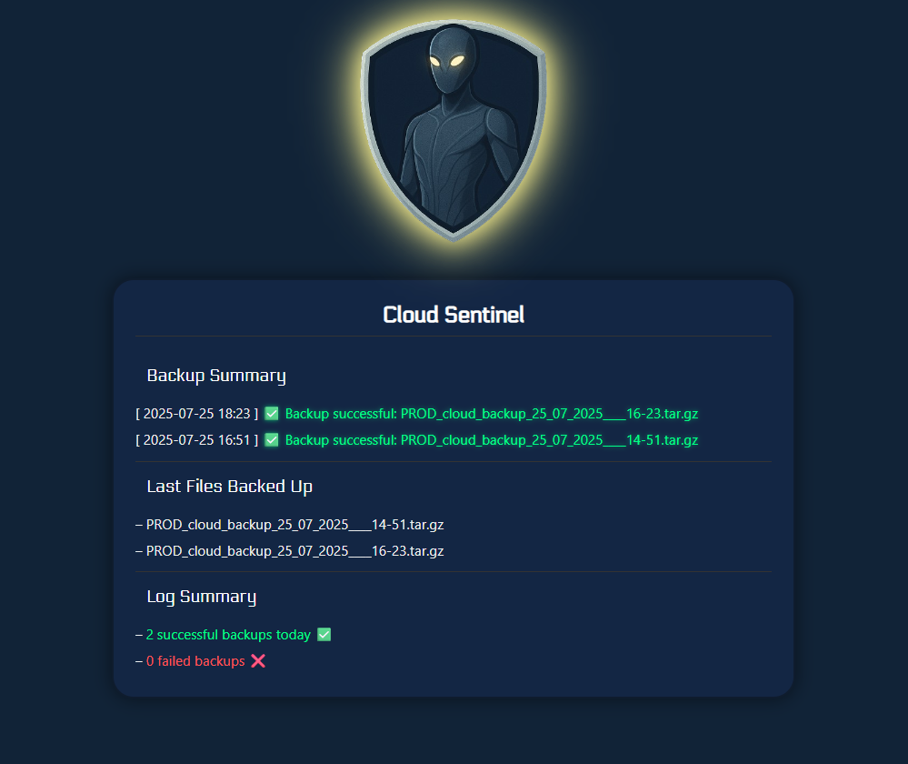
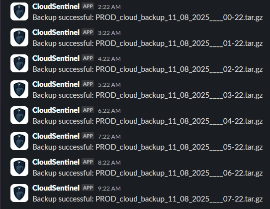
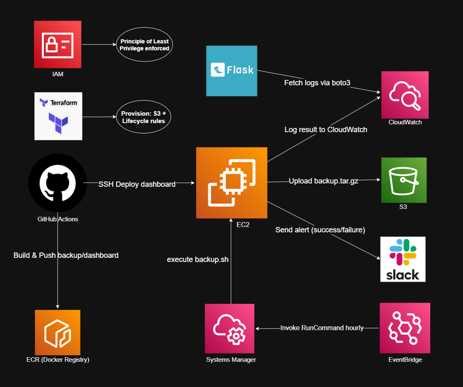

# ☁️ Cloud Sentinel

> Automated, secure and observable backup pipeline for EC2-to-S3, with alerts, logs, CI/CD and a live dashboard.  
> Built to simulate a real-world DevOps challenge: automate, containerize, monitor, and ship.

---
## 📚 Table of Contents

1. [🔎 Overview](#1-overview)  
2. [🛠️ Features](#2-features)  
3. [📦 Tech Stack](#3-tech-stack)  
4. [🧱 Architecture](#4-architecture)  
5. [⚙️ CI/CD Pipeline](#5-cicd-pipeline)  
6. [🔐 Security Practices](#6-security-practices)  
7. [💡 Why this project matters](#7-why-this-project-matters)  
8. [🗺️ Roadmap](#8-roadmap)  
---

## 1. Overview

**Cloud Sentinel** is a production-grade DevOps project that backs up data from an EC2 instance to Amazon S3 every hour.  
It features alerting via Slack, logging via CloudWatch, a `/status` dashboard in Flask, infrastructure provisioning via Terraform, and CI/CD built on GitHub Actions.

Designed to demonstrate real-world DevOps patterns: automation, observability, containerization, secure IAM access, and GitOps-style delivery.

---

## 2. Features

- 🔁 **Automated hourly backups** via EventBridge + SSM RunCommand  
- 🐚 `backup.sh`: compresses `/data`, uploads to S3  
- 📣 Sends alerts (success/failure) to Slack via Webhook  
- 📈 Logs status to CloudWatch Logs  
- 🖥️ Flask `/status` dashboard with live logs via `boto3`  
- 🐳 Fully containerized (Dockerfile: backup + dashboard)  
- 🔐 IAM Least Privilege: access only to required AWS services  
- ⚙️ CI/CD: test, lint, Trivy scan, Docker build, ECR push, EC2 deploy  
- 🏗️ Infrastructure provisioning with Terraform (S3 + lifecycle rules)

> Slack notifications

---

## 3. Tech Stack

| Tool / Service       | Purpose                                              |
|----------------------|------------------------------------------------------|
| **GitHub Actions**   | CI/CD: lint, test, Trivy scan, Docker build, deploy |
| **Docker**           | Containerization: backup + dashboard images         |
| **Amazon ECR**       | Stores Docker images for EC2 deployment             |
| **Amazon EC2**       | Runs both containers (backup and dashboard)         |
| **Amazon S3**        | Secure backup storage with 30-day retention         |
| **IAM**              | Least privilege policy: only S3, CWL, SSM access    |
| **Terraform**        | Infrastructure provisioning: S3 + lifecycle config  |
| **EventBridge**      | Scheduler: triggers backups hourly                  |
| **SSM RunCommand**   | Executes backup container remotely on EC2           |
| **CloudWatch Logs**  | Central logging from backup script                  |
| **Bash + AWS CLI**   | `backup.sh`: compress, upload, log, notify          |
| **Flask + boto3**    | `/status` dashboard with live logs from CloudWatch  |
| **Slack Webhook**    | Alerting on success/failure of backup jobs          |

---

## 4. Architecture

### 🔹 Flow Summary:
- `EventBridge` triggers SSM RunCommand hourly  
- `SSM` runs `docker run … backup-img` on EC2 (pulled from ECR)  
- Backup container:
  - Compresses `/data`
  - Uploads to S3
  - Logs to CloudWatch
  - Sends Slack alert  
- Flask dashboard polls CloudWatch and displays `/status`  
- GitHub Actions:
  - Lint, test, Trivy scan
  - Build Docker images
  - Push images to ECR
  - Deploy dashboard to EC2  
- Terraform provisions S3 + lifecycle rules  
- IAM policy scoped with least privilege (access to S3, CloudWatch, Slack, ECR)

---

## 5. CI/CD Pipeline

Implemented with **GitHub Actions** (`deploy.yml`):

- ✅ ShellCheck for `backup.sh`
- 🧪 Pytest for Flask dashboard
- 🛡 Trivy scan on both Docker images
- 🐳 Build + tag Docker images (backup + dashboard)
- 🚀 Push to ECR
- 🔄 SSH Deploy to EC2 instance
- 🩺 Health check on `/status`

---

## 6. Security Practices

- IAM least privilege: EC2 has access only to S3, CloudWatch, and SSM  
- Terraform-managed S3: public access blocked, lifecycle rules enabled  
- Secrets (Slack webhook, ECR and AWS credentials) managed via GitHub Secrets  
- Trivy security scan runs in every pipeline  

---

## 7. Why this project matters

> _“Cloud Sentinel was built to simulate a real DevOps scenario: automate critical backups, monitor status, and minimize access.”_

It shows hands-on understanding of:

- CI/CD delivery via GitHub Actions  
- Cloud automation with EventBridge, SSM, S3, CWL  
- Docker-based modular architecture  
- Infrastructure as Code (Terraform)  
- Observability and logging pipelines  
- Least privilege and secrets management

## 8. Roadmap
For more upcoming features and tracked improvements, see:  
👉 [GitHub Issues for Cloud Sentinel](https://github.com/jkot16/cloud-sentinel/issues)
